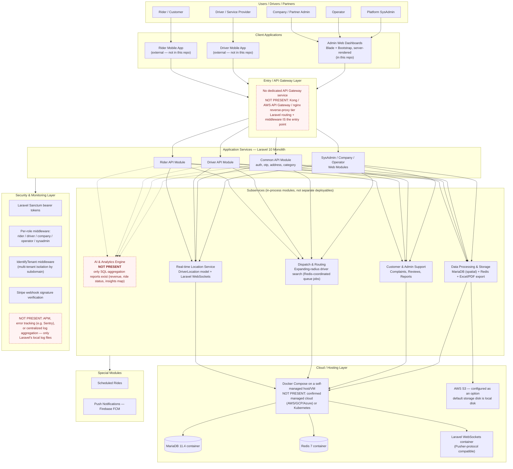
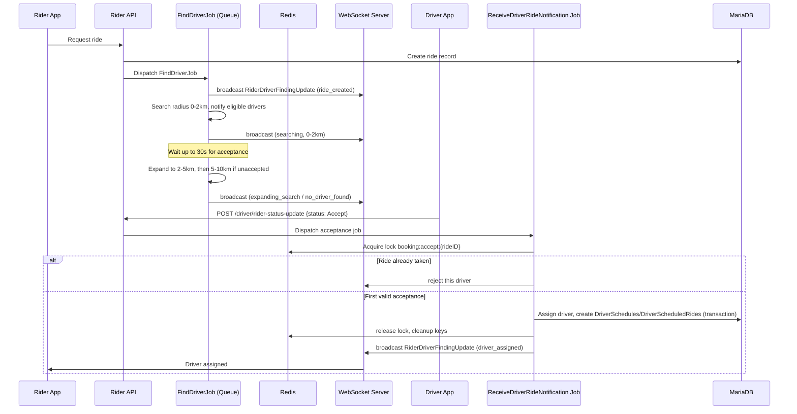
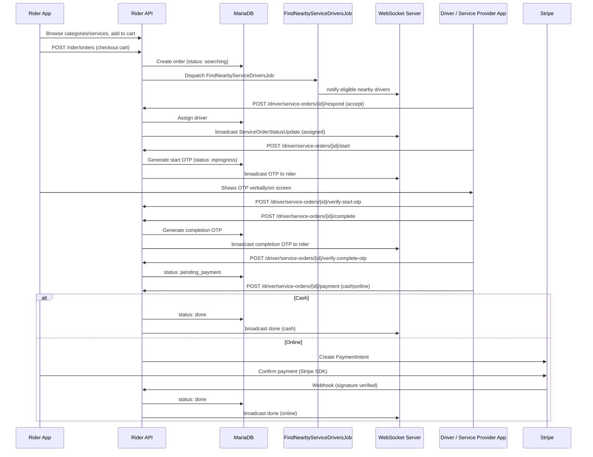
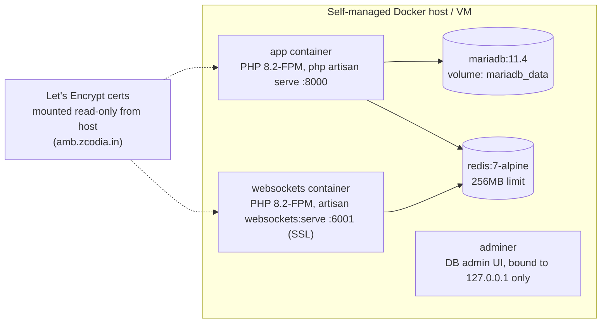
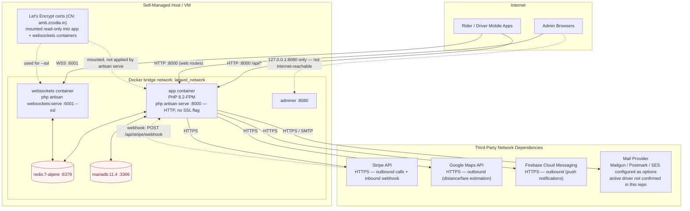

# High-Level Architecture & Technical Rendering

**Document Type:** High-Level Architecture & Technical Overview
**Audience:** Client / Stakeholders
**Version:** 1.0
**Date:** 2026-08-30
**Prepared from:** Direct inspection of the current codebase (Laravel 10 monolith) — no information in this document is assumed or projected. Anything not currently implemented is explicitly marked **NOT PRESENT**.

---

## 1. Purpose

This document describes the current, as-built technical architecture of the platform, covering both product lines it serves:

1. **Vehicle Booking (Taxi/Ride-hailing)** — Rider requests a ride, a Driver is dispatched, ride is completed and paid for.
2. **Service Booking (Home/Field Services)** — Rider books a service (e.g. plumbing, electrical, cleaning), a qualified Driver/Service Provider is dispatched, service is delivered and paid for.

It is meant to give the client an accurate picture of what exists today, so that scoping, estimation, and roadmap discussions are based on facts rather than assumptions.

---

## 2. System Summary

The backend is a **single Laravel 10 (PHP 8.2) monolithic application** — not a microservices architecture. It serves three kinds of clients from one codebase:

| Client | Interface | Where it lives |
|---|---|---|
| Rider mobile app | REST API (`/api/rider/*`) | Consumes this backend; **mobile app source code is not part of this repository** |
| Driver mobile app | REST API (`/api/driver/*`) | Consumes this backend; **mobile app source code is not part of this repository** |
| Admin / Company / Operator staff | Server-rendered web dashboards (Blade views) | Part of this repository (`resources/`, `routes/web.php`) |

The system is **multi-tenant**: each customer/partner company is identified by subdomain (`{company}.<main-domain>`), enforced via an `IdentifyTenant` middleware on every tenant-scoped route.

> **Note on "SLICE Mobile App":** no mobile app source, build config, or app-store artifact exists in this repository. This document treats "Mobile App" as the external client that talks to the API described below.

---

## 3. High-Level Architecture Diagram

---

## 4. The Two Booking Domains

Both domains share the same auth, tenant, notification, and payment infrastructure. They differ in what is being fulfilled: a *ride* vs. a *service order*.

### 4.1 Vehicle (Taxi) Booking — Dispatch Flow

Source: verified against `app/Jobs/FindDriverJob.php`, `app/Http/Controllers/Api/Driver/DriverRideUpdatesController.php`, and `DRIVER_SEARCH_FLOW.md` / `BOOKING_ACCEPTANCE_FLOW.md` in the repo root.

Key implementation facts (verified in code):
- Radius expansion is **0–2km → 2–5km → 5–10km**, each stage waiting up to 30 seconds for a driver to accept.
- Concurrent-acceptance race is resolved with a **Redis lock** (`booking:accept:{rideID}`) inside a DB transaction — only one driver can win.
- All progress is pushed to the rider over WebSocket on channel `private-rider-driver-finding-{rideID}` (event `RiderDriverFindingUpdate`).

### 4.2 Service Booking — Order Flow

Source: verified against `docs/service-booking-integration-guide.md` (existing integration guide already in this `docs/` folder) and `routes/api.php`.

Additional verified capability: drivers can register **additional services** discovered on-site (`/driver/service-orders/{id}/additional-services`), which also goes through its own OTP verification step before being added to the bill.

---

## 5. Application Services — Module Breakdown

The Laravel monolith is organized by role, under `app/Http/Controllers/`:

| Module | Path | Scope |
|---|---|---|
| Rider API | `app/Http/Controllers/Api/Rider/` | Cart, orders, addresses, payments, scheduled rides, vehicle types |
| Driver API | `app/Http/Controllers/Api/Driver/` | Online/offline/heartbeat, KYC, documents, bank accounts, service orders, vehicle, withdrawals |
| Common API | `app/Http/Controllers/Api/Common/` | Auth-adjacent shared endpoints: OTP, profile, address, categories, acceptance |
| Company (Partner Admin) | `app/Http/Controllers/Company/` | ~50 controllers — driver/rider management, KYC, pricing, analytics, payments, reports |
| Operator | `app/Http/Controllers/Operator/` | Scoped-down version of Company admin (drivers, riders, scheduled rides) |
| SysAdmin | `app/Http/Controllers/SysAdmin/` | Platform-wide administration mirroring Company controllers, plus tenant/company management |

This is a **role-partitioned monolith**, not domain microservices: Rider, Driver, Company, Operator, and SysAdmin are all controller namespaces inside one deployable app, sharing one database.

---

## 6. Subservices — What Exists vs. What Doesn't

| Subservice (as requested) | Status | What actually exists |
|---|---|---|
| **AI & Analytics Engine** | **NOT PRESENT** | No AI/ML or predictive models found anywhere in the codebase (verified by keyword search for OpenAI/GPT/ML/sentiment/TensorFlow — zero matches). What does exist: `AnalyticsController`, `CompanyAnalyticsController`, `TaxiAnalyticsController`, `ServiceAnalyticsController` — these compute revenue, ride-status, assigned-vs-missed, and completed-vs-canceled figures via direct SQL aggregation. This is standard business reporting, not AI. |
| **Real-time Location Service** | **Present** | `DriverLocation` model, `DriverLocationUpdate` / `DriverHeartbeat` / `DriverOnline` / `DriverOffline` events, dedicated `DriverHeartbeatChannel` + `DriverHeartbeatHandler`, delivered over a self-hosted **Laravel WebSockets** server (Pusher-protocol compatible, see `websockets.php`, `WEBSOCKET_HEARTBEAT_IMPLEMENTATION.md`). |
| **Dispatch & Routing** | **Present** | `FindDriverJob` (rides) and `FindNearbyServiceDriversJob` (service orders) — expanding-radius nearest-driver search, coordinated through Redis, using `tarfin-labs/laravel-spatial` for geospatial queries against MariaDB, and the Google Maps Distance/Geocoding API (used in `app/Models/Common.php`) for distance and fare estimation. No dedicated turn-by-turn routing engine is implemented — routing is limited to distance/ETA estimation for dispatch and pricing. |
| **Customer & Admin Support** | **Present** | `FeedbackAndComplaints` model, `DriverComplaintsContoller` / `RiderComplaintsContoller` (Company & SysAdmin), driver/rider review controllers, report/export controllers (Excel via `maatwebsite/excel`, PDF via `barryvdh/laravel-dompdf`). This is admin-dashboard-driven support tooling, not a ticketing/helpdesk platform. |
| **Data Processing & Storage** | **Present** | MariaDB 11.4 (with spatial extension) as system of record, Redis 7 for cache/queue/locking, local disk as the default file storage driver, with AWS S3 available as a configured-but-not-confirmed-active alternative (`FILESYSTEM_DISK` env var, default `local`). |

---

## 7. Cloud / Hosting Layer

Verified from `docker-compose.yml` and `Dockerfile`:

- **Not present / not confirmed:** container orchestration (Kubernetes/ECS), auto-scaling, managed database service, CDN, load balancer, blue-green or zero-downtime deployment pipeline, staging/production environment separation beyond `.env` files.
- The current setup is a **single-host Docker Compose stack** — appropriate for the current stage, but a scaling/HA plan would need to be defined separately if the client requires it.
- TLS termination is handled at the application container level using certificates mounted from the host (`amb.zcodia.in`), not by a separate load balancer or ingress.

---

## 8. Security & Monitoring Layer

| Concern | Implementation | Status |
|---|---|---|
| Authentication | Laravel Sanctum (bearer token), separate login/register/OTP flows for Rider and Driver | Present |
| Authorization | Dedicated middleware per role: `RiderApiMiddleware`, `DriverApiMiddleware`, `CompanyMiddleware`, `OperatorMiddleware`, `SystemAdminMiddleware` | Present |
| Multi-tenancy isolation | `IdentifyTenant` middleware, tenant resolved from subdomain (`{company}.<domain>`) | Present |
| Payment security | Stripe webhook handler validates Stripe's signature (`StripeWebhookController`) | Present |
| CSRF / cookie security | Standard Laravel `VerifyCsrfToken`, `EncryptCookies`, `TrustHosts`, `TrustProxies` (for the web/admin side) | Present |
| API documentation security tooling | `darkaonline/l5-swagger` (OpenAPI/Swagger) is installed as a dependency, but **zero `@OA` annotations exist in the codebase** — no generated Swagger UI is actually available today | **Installed but unused** |
| Application monitoring / APM | — | **NOT PRESENT** — no Sentry, New Relic, Datadog, or equivalent found |
| Centralized logging | — | **NOT PRESENT** — Laravel's default local log channel only; no log aggregation/shipping configured |
| Automated security scanning / WAF | — | **NOT PRESENT** in this repository |

For full RBAC role definitions, audit logging, and threat monitoring/incident response status, see §15.

---

## 9. Special Modules

| Module | Status | Detail |
|---|---|---|
| **Scheduled Rides** | Present | `PostSchedule` and `SendRiderScheduleNotification` jobs, `DriverSchedules`/`RiderSchedules` models, with dedicated cancel/list endpoints. |
| **Push Notifications** | Present | Firebase Cloud Messaging via `kreait/laravel-firebase`, `FCMNotification` model, `PushNotificationContoller` (broadcast to user groups). |

---

## 10. API Surface (Current)

Verified `.http` request collections exist under `APIs/` and are the closest thing to a living, tested API reference today:

| Area | File(s) | Approx. endpoint count |
|---|---|---|
| Rider — Auth | `APIs/Rider/auth_apis.http` | 25 |
| Rider — Scheduled rides | `APIs/Rider/rider_scheduled_rides.http`, `rider_schedule_full_flow.http` | 29 |
| Rider — Orders / Cart / Services | `rider_orders.http`, `rider_cart.http`, `rider_services.http`, `rider_categories.http` | 27 |
| Driver — Core flow | `driver.http`, `driver.v1.http`, `driver_flow.http` | 93 |
| Driver — Service orders | `driver_service_orders.http`, `driver_additional_services.http`, `driver_services.http`, `driver_categories.http` | 30 |
| Driver — Account | `driver-change-password.http`, `driver-forgot-password.http` | 6 |
| Admin | `APIs/Admin/service_state_prices.http` | 4 |

A full, narrative API reference for the **Service Booking** domain (auth, cart, orders, OTP, payments, WebSocket events, error codes) already exists at [`docs/service-booking-integration-guide.md`](./service-booking-integration-guide.md) in this repository — that document should be treated as the authoritative API reference for that domain and extended, not duplicated. **An equivalent narrative guide for the Vehicle (Taxi) Booking domain does not yet exist** — the `.http` files and `BOOKING_ACCEPTANCE_FLOW.md` / `DRIVER_SEARCH_FLOW.md` in the repo root are the only current references, and would need to be consolidated into client-facing API documentation.

Machine-readable OpenAPI/Swagger output is **not currently available** (see §8) — this is the main gap for handing the client a formal, importable API spec (e.g. for Postman/SwaggerUI).

---

## 11. Technology Stack (Verified)

| Layer | Technology |
|---|---|
| Language / Framework | PHP 8.2, Laravel 10.10 |
| Database | MariaDB 11.4, with spatial queries via `tarfin-labs/laravel-spatial` |
| Cache / Queue / Locking | Redis 7 |
| Real-time | `beyondcode/laravel-websockets` (self-hosted, Pusher-protocol compatible) |
| Auth | Laravel Sanctum (token-based) |
| Payments | Stripe (`stripe/stripe-php`) |
| Push notifications | Firebase Cloud Messaging (`kreait/laravel-firebase`) |
| File export | `maatwebsite/excel`, `barryvdh/laravel-dompdf` |
| Maps / distance | Google Maps API (Distance Matrix / Geocoding, used server-side) |
| Admin UI | Laravel Blade + Bootstrap (server-rendered) |
| Containerization | Docker, Docker Compose |
| API docs tooling | `darkaonline/l5-swagger` — installed, not yet populated |

---

## 12. General Platform Presentation & Functional Descriptions

This section describes the platform in functional/product terms — what each type of user can actually do — independent of the technical implementation covered elsewhere in this document. It is derived directly from the controllers, routes, and models that exist in the codebase today; nothing here is aspirational.

### 12.1 Platform Overview

The platform is a **multi-tenant SaaS system**: each partner company operates its own branded instance (own subdomain, own drivers, own service catalog, own pricing) on shared infrastructure. Within each tenant, the platform runs two booking businesses side by side:

- **Vehicle Booking** — an on-demand taxi/ride-hailing service.
- **Service Booking** — an on-demand home/field-service marketplace (e.g. plumbing, electrical, cleaning).

Five distinct actor types interact with the platform, each with a purpose-built interface: **Rider**, **Driver/Service Provider**, **Company (Partner) Admin**, **Operator**, and **Platform SysAdmin**.

### 12.2 Rider — Functional Capabilities

- Register and log in (email/mobile + password); verify identity via email and SMS OTP.
- Manage profile, saved addresses, and a profile photo.
- Browse available vehicle types and their facilities (e.g. AC, luggage capacity) for ride booking.
- Browse service categories, subcategories, and individual services for service booking.
- Get an instant distance-and-fare estimate before booking a ride.
- Request a ride and track, in real time, the search for a nearby driver (progressive radius expansion with live status updates).
- Add services to a cart, adjust quantities, and check out as an order.
- Track a ride's or order's full lifecycle in real time (searching → assigned → in progress → completed).
- Schedule a ride in advance, and view or cancel scheduled rides.
- Verify service start and completion using driver-entered OTP codes shown on their own screen.
- Pay by cash or card (Stripe) for both rides and service orders.
- Leave reviews for drivers/service providers, and raise complaints.
- View a rider credit/wallet balance and its history.

### 12.3 Driver / Service Provider — Functional Capabilities

- Register, log in, and use a password-reset flow independent of the rider's.
- Go online/offline and send periodic heartbeat/location updates so the platform knows availability and position.
- Complete KYC: upload identity/license documents and track their approval and expiry status.
- Register one or more vehicles and link a bank account for payouts.
- Set which service categories/subcategories they are qualified and mapped to perform.
- Receive and accept/decline ride and service-order requests as they are dispatched.
- Update ride status through the trip lifecycle (e.g. arrived, started, completed).
- For service orders: start a service (generating a rider-facing OTP), complete it (generating a second OTP), and register any additional on-site services discovered mid-job (each independently OTP-verified).
- Select the payment method (cash or online) at the end of a ride or service order.
- View and manage their own schedules and appointments.
- Request withdrawals of accumulated earnings.
- View reviews left about them, and file/track their own complaints.

### 12.4 Company (Partner) Admin — Functional Capabilities

Company Admins run one tenant's entire operation from a web dashboard. They can:

- Manage the driver roster: onboarding, KYC approval, document/license expiry tracking, vehicle assignment, bank details, and service-category mapping.
- Manage the rider base: profiles, addresses, credits/wallet adjustments, and complaint handling.
- Define the service catalog: categories, subcategories, individual services, and facility items (vehicle amenities).
- Configure pricing: vehicle pricing, and service pricing that can vary by state (state-wise price lists).
- Configure operating geography: zones, neighborhoods, and state-level settings.
- Configure tax rules and payment settings for the tenant.
- Review and moderate driver and rider reviews and complaints.
- Track and manage scheduled rides across the whole driver fleet.
- Send push notifications to riders/drivers, individually or by group, and manage notification group membership.
- Customize the email templates used for tenant communications.
- View operational analytics: revenue trends, ride-status breakdowns, an insights map, assigned-vs-missed rides, and completed-vs-canceled rides — plus equivalent service-booking analytics.
- Generate and export reports (Excel/PDF).
- Manage payments and driver withdrawal requests.
- Manage the operator accounts (see 12.5) that work under them.

### 12.5 Operator — Functional Capabilities

Operators are a scoped-down version of the Company Admin role, intended for day-to-day staff rather than the tenant owner. They can manage drivers, driver vehicles, riders, rider credits, and scheduled rides — but do not get the tenant-wide configuration screens (pricing, taxes, zones, categories) that a Company Admin has.

### 12.6 Platform SysAdmin — Functional Capabilities

The SysAdmin role operates above all tenants and mirrors nearly every Company Admin capability, but at platform scope:

- Onboard and manage companies/tenants themselves (the customers of the platform).
- Perform the same driver, rider, KYC, complaint, review, pricing, zone, tax, and notification management as a Company Admin — but selectable across any tenant.
- Manage platform-wide payments and bank lists.
- View platform-wide analytics and reports.

### 12.7 Shared, Cross-Cutting Functionality

These capabilities are available across roles rather than being specific to one:

- Real-time updates over WebSocket for ride search, order status, and driver location/heartbeat.
- Push notifications (Firebase Cloud Messaging).
- Stripe-based online payments alongside cash.
- Multi-tenant isolation — every tenant's data, drivers, and riders are scoped to that tenant's subdomain only.

---

## 13. Network & Technical Architecture Specifications

This section documents the platform's network topology, ports, protocols, and inter-service communication paths, as they are actually configured in `docker-compose.yml`, `Dockerfile`, `start.sh`, and the relevant `config/*.php` files — not as a target/ideal design.

### 13.1 Network Topology Diagram

`DB` and `REDIS` are highlighted because `docker-compose.yml` publishes them as `"3306:3306"` and `"6379:6379"` — no host-interface restriction — unlike Adminer, which is explicitly bound to `127.0.0.1:8080:8080`. See §13.10.

### 13.2 Ports & Protocols

| Port | Protocol | Container / Service | Host Exposure |
|---|---|---|---|
| 8000 | HTTP (Laravel's built-in dev server, `php artisan serve`) | `app` — API + admin web routes | Published to all interfaces |
| 6001 | WSS (TLS enabled explicitly via `--ssl`) | `websockets` — Laravel WebSockets (Pusher-protocol) | Published to all interfaces |
| 3306 | MySQL wire protocol | `mariadb` | Published to all interfaces (`3306:3306`) |
| 6379 | Redis protocol | `redis` | Published to all interfaces (`6379:6379`) |
| 8080 | HTTP | `adminer` (DB admin UI) | Bound to `127.0.0.1` only — not internet-reachable |

### 13.3 TLS / Certificate Scope

- The certificate bundled in this repo (`fullchain.pem` / `privkey.pem`) is issued for a **single hostname**: `CN=amb.zcodia.in`, with no wildcard or additional SANs (verified via `openssl x509`).
- The **WebSockets server explicitly enables TLS** (`websockets:serve --port=6001 --ssl`), so port 6001 does terminate HTTPS/WSS using this certificate.
- The **main application (port 8000) does not** — `start.sh` runs `php artisan serve --host=0.0.0.0 --port=8000` with no SSL flag, and Laravel's built-in development server does not terminate TLS on its own. Whatever serves HTTPS for the API/admin routes in production (reverse proxy, load balancer, CDN) is **not present in this repository** and should be confirmed separately.
- The multi-tenant routing pattern (`{company}.<main_domain>`, §13.4) implies a wildcard subdomain needs to resolve and be covered by a certificate. The certificate present in this repo is single-domain, not wildcard — production wildcard/multi-SAN certificate coverage should be confirmed; it is not demonstrated in this codebase.

### 13.4 DNS & Multi-Tenant Domain Routing

- Tenant routing is subdomain-based: `Route::domain('{_company}.' . config('app.main_domain'))` (see `routes/api.php`).
- `main_domain` is set via `APP_MAIN_DOMAIN`, defaulting to `atomscribe.com` in `config/app.php`.
- The WebSockets host is separately hardcoded to `amb.zcodia.in` in `config/websockets.php`.
- These two domains don't match in the tracked configuration — worth confirming with whoever manages DNS/production config which is authoritative today; this repository does not resolve that on its own.

### 13.5 Internal Service Communication

| Path | Protocol | Purpose |
|---|---|---|
| `app` ↔ `mariadb` | MySQL wire protocol, port 3306 | Primary data store |
| `app` ↔ `redis` | Redis protocol, port 6379 | Cache, queue, cross-process locking (e.g. the `booking:accept:{rideID}` lock, §4.1) |
| `websockets` ↔ `redis` | Redis protocol, port 6379 | Shared with `app` for broadcasting coordination |
| `app` → `websockets` | Pusher broadcast protocol | Real-time event delivery (ride/order status, driver location/heartbeat) |

All of the above happen inside the single `laravel_network` Docker bridge network defined in `docker-compose.yml`.

### 13.6 External / Third-Party Network Dependencies

| Service | Direction | Protocol | Purpose |
|---|---|---|---|
| Stripe API | Outbound (app → Stripe) + Inbound webhook (Stripe → app) | HTTPS | Online payments; webhook signature-verified at `POST /api/stripe/webhook` |
| Google Maps API | Outbound | HTTPS | Distance/fare estimation (`app/Models/Common.php`) |
| Firebase Cloud Messaging | Outbound | HTTPS | Push notifications (`kreait/laravel-firebase`) |
| Mail provider | Outbound | HTTPS/SMTP | Transactional email; Mailgun, Postmark, and SES are all configured as options in `config/services.php` — which one is active is not confirmed from the tracked config |

### 13.7 Queue & Asynchronous Processing

- The tracked `.env` sets `QUEUE_CONNECTION=redis`, and several jobs implement `ShouldQueue`: `FindDriverJob`, `FindNearbyServiceDriversJob`, `PostSchedule`, `ReceiveDriverRideNotification`, `ReceiveDriverServiceOrderNotification`, `SendRiderScheduleNotification`.
- **No queue worker process (`php artisan queue:work`) is defined anywhere in the tracked infrastructure** — `docker-compose.yml`, `Dockerfile`, and `start.sh` only start the HTTP server and the WebSockets server. How these queued jobs are actually consumed in the running environment is not visible in this repository and should be confirmed (e.g. a worker process managed outside this repo, a supervisor config not committed, or `QUEUE_CONNECTION` overridden at runtime).

### 13.8 CORS & Cross-Origin Policy

From `config/cors.php`, applied to `api/*` and `sanctum/csrf-cookie` paths:

| Setting | Value |
|---|---|
| `allowed_origins` | `*` |
| `allowed_methods` | `*` |
| `allowed_headers` | `*` |
| `supports_credentials` | `false` |

This is a fully open CORS policy. It's low-risk for token-based mobile clients (which aren't subject to browser CORS), but would need tightening before any browser-based frontend is added against this API.

### 13.9 Authentication Token Flow (Network Level)

- Mobile clients authenticate once (login or OTP) and receive a Sanctum bearer token; every subsequent request carries `Authorization: Bearer {token}` — API traffic is stateless at the network level, with no server-side session/cookie dependency.
- Sanctum's `stateful` domain list (cookie-based auth, used for same-site SPA frontends) is left at Laravel's framework defaults (`localhost`, `127.0.0.1`, current app URL) — not customized for a production browser frontend, consistent with there being no browser SPA client in this repository today.

### 13.10 Network Security Observations

- `mariadb` (`3306:3306`) and `redis` (`6379:6379`) are published without a host-interface restriction in `docker-compose.yml`, unlike `adminer`, which is explicitly bound to `127.0.0.1:8080:8080`. Unless blocked by a firewall/security group outside this repo, both are reachable from outside the Docker network by default.
- No WAF, network-level rate limiting, or intrusion detection is present in this repository — this is the network-layer counterpart to the monitoring gap already noted in §8.

---

## 14. Equipment & Hosting Documentation

This section covers the technical specification of the equipment/infrastructure the platform currently runs on, what compliance/conformity data exists for it, how it handles data processing today, and — separately and explicitly — a **production readiness plan that is not yet implemented**.

### 14.1 Current Deployment Model — Development Environment

The only deployment artifact that exists in this repository (`docker-compose.yml`, `Dockerfile`) targets a **single self-managed host running Docker Compose**. It is a development/staging-grade setup, not a production architecture — there is no orchestration, redundancy, or managed infrastructure behind it (also see §7 and §13).

**Container equipment specification** (as declared in `docker-compose.yml`):

| Container | Base Image | Declared Resource Limits | Persistent Storage |
|---|---|---|---|
| `app` | `php:8.2-fpm` (custom-built via `Dockerfile`) | None declared | Bind mount: entire repo (`.:/var/www/html`) |
| `websockets` | `php:8.2-fpm` | None declared | Same bind mount as `app` |
| `mariadb` | `mariadb:11.4` | None declared | Named volume `mariadb_data` |
| `redis` | `redis:7-alpine` | Memory limit: 256 MB | None (in-memory; no persistence volume declared) |
| `adminer` | `adminer:latest` | None declared | None |

**Host-level equipment** (VM/server specs: CPU, RAM, disk, OS, cloud provider or bare-metal, region) is **NOT PRESENT / NOT CONFIRMED** in this repository — no infrastructure-as-code, cloud provider config, or server inventory exists to source this from. This must be obtained from whoever provisioned the current host.

**Note on Redis persistence:** no volume is mounted for the `redis` container, so cached/queued data (including the job queue described in §13.7 and the ride-acceptance locks in §4.1) does not survive a container restart. This is consistent with a development setup but would need to change for production.

### 14.2 Conformity / Compliance Data

- **No formal infrastructure compliance certifications** (e.g. ISO 27001, SOC 2, PCI-DSS attestation for the hosting environment) exist in or are referenced by this repository.
- **Card payment data does not touch this application's servers** — Stripe's PaymentIntent flow (documented in §4.2 and the service-booking integration guide) means raw card numbers are handled client-side by the Stripe SDK and confirmed directly with Stripe; the backend only ever sees a payment intent ID and Stripe's signed webhook. This keeps the application itself outside full PCI-DSS card-data scope, though the underlying hosting environment has not been formally assessed.
- **No documented data residency, retention, or backup/disaster-recovery policy** exists for the current host.
- **No data processing agreements (DPAs) or GDPR-equivalent documentation** are present in this repository for the third-party processors already in use (Stripe, Google Maps, Firebase, the configured mail provider — see §13.6). If the client operates in a jurisdiction requiring these, they need to be sourced/executed with each provider directly; none of that paperwork lives in or is generated by this codebase.

### 14.3 Cloud Data Processing Setup (Current)

- All application compute, the primary database, and the cache/queue currently run **co-located on one host** — there is no separation between compute, data, and processing tiers, and no defined data-processing region.
- Third-party data processors already integrated (detailed in §13.6): **Stripe** (payment data), **Google Maps API** (location/address data used for distance queries), **Firebase Cloud Messaging** (device push tokens), and a **configured-but-unconfirmed mail provider** (email addresses, message content).
- File uploads/storage default to the **local disk** of the single host (`FILESYSTEM_DISK=local`); AWS S3 is configured as an available option in `config/filesystems.php` but is not confirmed as the active driver.

### 14.4 Production Hosting — Best-Practice Plan (Not Yet Implemented)

**Everything below is a recommended baseline, not a description of what exists today.** The current Docker Compose setup (§14.1) is explicitly a development configuration; the following should be scoped and implemented when production deployment is planned:

| Area | Current (Development) | Recommended for Production |
|---|---|---|
| Orchestration | Single-host Docker Compose, manual restarts | Managed container orchestration (e.g. ECS/Kubernetes) or at minimum a supervised multi-host setup with health checks and auto-restart |
| TLS termination | Not confirmed for the main app (§13.3) | Dedicated reverse proxy / load balancer terminating TLS with a certificate covering the full `*.<main_domain>` wildcard |
| Database/cache network exposure | MariaDB and Redis ports published to all interfaces (§13.10) | Restrict to the internal network only, matching the pattern already used for Adminer |
| Queue processing | No worker process defined (§13.7) | A supervised `php artisan queue:work` process (e.g. via Supervisor or a dedicated worker service) with auto-restart, plus `php artisan schedule:run` on a cron if scheduled tasks are needed |
| Database persistence & recovery | Single `mariadb` container, no confirmed backup policy | Managed/backed-up database service (or self-managed with automated backups, point-in-time recovery, and a documented retention policy) |
| File storage | Local disk on a single host | Object storage (S3 — already configured as an option) for durability and horizontal scalability |
| Observability | Local log files only (§8, §13.10) | APM, error tracking, and centralized log aggregation |
| Secrets management | Plaintext `.env` file on disk | A dedicated secrets manager appropriate to the chosen hosting provider |
| Environments | One `.env`, no confirmed staging/production split | Distinct staging and production environments with independent configuration |
| Horizontal scaling | Single app instance | App tier can scale horizontally behind a load balancer once WebSocket connections are handled by a load-balancer/service that supports them (auth is already stateless — bearer tokens, §13.9 — which helps here) |
| Compliance | None documented (§14.2) | Data residency, backup/retention policy, and any required certifications (ISO 27001/SOC 2/PCI scope) defined against the client's actual regulatory requirements once a production host is selected |

---

## 15. Cybersecurity — RBAC, Audit Logging & Threat Monitoring

This section gives the full detail behind the summary in §8: access control, audit logging, and threat monitoring/incident response, as they exist today.

### 15.1 Role-Based Access Control (RBAC) — Available

Yes — the platform implements RBAC. Every request is authenticated, matched to exactly one role, and scoped to a single tenant.

**Roles:**

| Role | Middleware Alias | Middleware Class | Enforced On | Scope |
|---|---|---|---|---|
| Platform SysAdmin (superadmin) | `systemadmin` | `SystemAdminMiddleware` | `routes/web.php` — `systemadmin` prefix | Full platform access, across all tenants |
| Company (Partner) Admin | `company` | `CompanyMiddleware` | `routes/web.php` — `company` prefix | Full access within their own tenant only |
| Operator | `operator` | `OperatorMiddleware` | `routes/web.php` — `operator` prefix | Scoped subset of Company Admin capabilities, within their own tenant |
| Rider | `riderapi` | `RiderApiMiddleware` | `routes/api.php` — `rider` prefix (with `auth:sanctum` + `IdentifyTenant`) | Own account/rides/orders only, within their tenant |
| Driver / Service Provider | `driverapi` | `DriverApiMiddleware` | `routes/api.php` — `driver` prefix (with `auth:sanctum` + `IdentifyTenant`) | Own account/assigned rides/orders only, within their tenant |

**How access is enforced (request path):**

1. **Authentication** — Laravel Sanctum verifies the bearer token and resolves `$request->user()`.
2. **Tenant identification** — `IdentifyTenant` middleware resolves the company from the request's subdomain and sets `$request->company_id`.
3. **Role check** — the role-specific middleware (e.g. `RiderApiMiddleware`) confirms `$request->user()->type` matches the expected role for that route group.
4. **Tenant match** — `AuthHelper::validateCompanyAccess()` compares the authenticated user's `userCompanyID` against the subdomain-resolved `company_id` and aborts with `403 Forbidden` on a mismatch. This is the control that stops a valid token from one tenant being used against another tenant's subdomain.
5. **Account status check** — `active` accounts proceed; `pending` accounts are limited to a small allow-list of onboarding endpoints (profile, OTP, KYC, documents, address, bank details); other statuses are rejected with `401`.

**Supporting controls:**

- Passwords are hashed with **bcrypt** (Laravel's default — `config/hashing.php`).
- API requests are rate-limited: **60 requests/minute per authenticated user (or per IP if unauthenticated)** — defined in `App\Providers\RouteServiceProvider` and applied via `throttle:api` across the entire `api` middleware group.

**Implementation notes (structural observations, not a judgment on sufficiency):**

- **RBAC is role-level, not permission-level.** There is no fine-grained permissions/ACL package (e.g. `spatie/laravel-permission`) and no Laravel Policy/Gate classes (`app/Policies` does not exist in this codebase). Each role gets one middleware gating entire route groups — there is no sub-role permission matrix (e.g. "Operator can view but not edit pricing").
- **Sanctum tokens do not expire.** `config/sanctum.php` has `'expiration' => null`. A token stays valid until the user logs out (which revokes it) or an admin deletes it — there is no automatic time-based expiry.
- **`app/Http/Middleware/DriverMiddleware.php` is dead/orphaned code.** It is not registered in `app/Http/Kernel.php`'s middleware alias list (only `DriverApiMiddleware` is registered, as `driverapi`), so it cannot currently be reached via any route. It also contains an unconditional debug statement (`echo "<pre>"; print_r($request->user()); exit;`) at the top of its `handle()` method — if it were ever wired into a route, it would dump user data and halt the request. Recommend deleting it to prevent accidental future use.
- **`IdentifyTenant` middleware does not null-check its tenant lookup** — `User::where('websiteName', $company)->first()->id` throws an unhandled PHP error (not a clean 404/403) if the subdomain doesn't match any company. This is more an availability/robustness concern than an access-control bypass, but it's why a malformed or unregistered subdomain produces a server error instead of a clean response.

### 15.2 Audit Logging — Not Available

No audit logging exists at this moment. Specifically:

- No activity-log package is installed (e.g. `spatie/laravel-activitylog` is not in `composer.json`).
- No "who changed what, when" trail exists for admin actions (driver approval, pricing changes, complaint resolution, payouts, etc.).
- Authentication events (login, failed login, logout, token revocation) are not separately logged beyond Laravel's default application log — and that log is local-file-only (§8/§13.10 — no centralized log aggregation).

If audit trails are required (e.g. for compliance or dispute resolution — particularly relevant for payment, payout, and KYC-approval actions), this needs to be scoped and built; nothing in the current codebase provides it.

### 15.3 Threat Monitoring & Incident Response — Not Available

No threat monitoring or incident response tooling/protocol exists at this moment. Specifically:

- No intrusion detection/prevention system (IDS/IPS) or Web Application Firewall (WAF).
- No Application Performance Monitoring or error-tracking service (e.g. Sentry, Datadog) — confirmed absent from `composer.json` and the Docker Compose stack.
- No documented incident response plan, runbook, escalation path, or on-call process exists in this repository.
- No automated alerting for anomalous activity (e.g. repeated failed logins, unusual payout requests, spikes in complaints) is configured.

### 15.4 Additional Finding: Debug Mode in the Tracked Docker Compose Config

`docker-compose.yml` sets `APP_ENV=local` and **`APP_DEBUG=true`** on the `app` container. If this same Compose file/image were used as-is for a production deployment, debug mode being on means error responses can include stack traces and internal file paths. This must be set to `APP_ENV=production` / `APP_DEBUG=false` for any real deployment — it's already part of the production checklist in §14.4, but since it's specifically a cybersecurity finding (information disclosure), it's called out here too.

### 15.5 Cybersecurity Summary

| Area | Status |
|---|---|
| Role-Based Access Control | **Available** — 5 roles, tenant-scoped, token-authenticated (see §15.1) |
| Audit Logging | **Not available** |
| Threat Monitoring | **Not available** |
| Incident Response Protocol | **Not available** |
| Rate Limiting | Available — 60 req/min per user/IP (default Laravel throttle) |
| Password Hashing | Available — bcrypt |
| Token Expiry | Not configured — tokens do not expire automatically |

---

## 16. Disaster Recovery Plan

### 16.1 Current State — No Disaster Recovery Plan Exists

There is no disaster recovery plan today. This is stated plainly because it's a real operational risk, not a documentation gap — evidence:

- **No backup package or tooling is installed** (checked `composer.json` — no `spatie/laravel-backup` or equivalent; no backup scripts, cron jobs, or automation exist anywhere in this repository).
- **MariaDB data lives in a single Docker named volume (`mariadb_data`) on one host.** If that host or volume is lost, the data is lost with it — there is no replica, automated snapshot, or offsite copy.
- **Redis has no persistence volume at all** (§14.1) — cached data, the job queue, and cross-process locks (e.g. the ride-acceptance lock in §4.1) do not survive even a normal container restart today, let alone a disaster.
- **Uploaded files default to local disk on the same single host** (§14.3) — no redundancy.
- **Laravel's task scheduler is defined but its execution is not confirmed.** `app/Console/Kernel.php` schedules `report:process-pending-reports` and `driver:check-heartbeats`, but — consistent with the missing queue worker already noted in §13.7 — no cron entry for `php artisan schedule:run` exists in `docker-compose.yml`, `Dockerfile`, or `start.sh`. Whether these scheduled commands run at all in the current environment is not confirmed by this repository.
- **No Recovery Time Objective (RTO) or Recovery Point Objective (RPO) is defined.**
- **No failover procedure, standby host, or secondary region exists.**
- **No disaster-recovery drill or restore test has ever been performed or documented.**

**What this means in concrete terms:** if the current host were lost today (hardware failure, accidental deletion, provider incident), all ride/service-booking data, rider/driver accounts, KYC documents, and uploaded files would be unrecoverable — there is no copy of any of it anywhere outside this single host.

### 16.2 Recommended Disaster Recovery Plan (Not Yet Implemented)

**Everything below is a recommended baseline, not a description of what exists today.** As with the production hosting plan in §14.4, this should be scoped and implemented when production deployment is planned:

| Area | Current | Recommended for Production |
|---|---|---|
| Database backups | None | Automated backups (e.g. `mysqldump` or volume snapshot) on at least a daily schedule, shipped to offsite/object storage, with a defined retention policy (e.g. 30 daily + 12 monthly) |
| Backup verification | Never tested | Periodic automated restore test to confirm backups are actually restorable, not just taken |
| RTO / RPO | Undefined | Explicit targets agreed with the client (e.g. RPO ≤ 24h, RTO ≤ a few hours), with backup frequency and infrastructure designed around them |
| Redis durability | In-memory only, no persistence | Either enable Redis persistence (RDB/AOF) for anything business-critical, or confirm nothing business-critical lives only in Redis without a corresponding database record |
| Single point of failure | Entire stack (app, DB, cache, WebSockets) on one host | Separate the database onto a managed/replicated service, or at minimum a distinct host with its own independent backup lifecycle |
| File storage redundancy | Local disk on the single host | Object storage with versioning enabled (S3 is already configured as an option — §14.3/§14.4) |
| Failover | None | A documented failover procedure — a manual runbook at minimum, automated failover if a managed database service is adopted |
| Scheduled task execution | Not confirmed active (no `schedule:run` cron entry) | A supervised cron/systemd-timer entry running `php artisan schedule:run` every minute, monitored so a silent failure is noticed |
| DR testing | Never performed | Scheduled DR drills (e.g. annually, or after any major infrastructure change) with results documented |
| Incident/outage communication | Not documented | A defined communication plan for who is notified and how during an outage — ties into the incident response gap already noted in §15.3 |

---
<!-- 
## 17. Summary of Gaps (Explicit, for Planning Purposes)

These are called out honestly so they can be scoped as future work rather than assumed to exist:

1. **No dedicated API Gateway** — Laravel's own router + middleware is the front door. If the client needs rate limiting, centralized API-key management, or request transformation independent of the app, this is a gap.
2. **No AI & Analytics Engine** — current analytics are SQL-based dashboards, not predictive/ML-driven.
3. **No confirmed managed cloud infrastructure** — currently a single Docker Compose host; no orchestration, auto-scaling, or managed DB service confirmed. See §14.4 for the production best-practice plan.
4. **No APM / error tracking / centralized logging** — operational visibility today is local log files only.
5. **No generated OpenAPI/Swagger spec**, despite the tooling being installed — client cannot currently get a machine-readable API contract.
6. **No narrative API guide for the Vehicle (Taxi) Booking domain** equivalent to the existing Service Booking guide.
7. **No confirmed TLS termination for the main API/admin app (port 8000)** — only the WebSockets server explicitly enables SSL; see §13.3.
8. **Database and cache ports (3306, 6379) are published without host-interface restriction** in the current Docker Compose file; see §13.10.
9. **No queue worker process is defined in tracked infrastructure**, despite `QUEUE_CONNECTION=redis` and multiple queued jobs; see §13.7.
10. **No audit logging** for admin actions or authentication events; see §15.2.
11. **No threat monitoring or incident response protocol**; see §15.3.
12. **No disaster recovery plan, backup automation, or defined RTO/RPO exists** — a single host loss today would be unrecoverable; see §16.

---

## 18. Source References

This document was produced by direct inspection of, and cross-referencing between:
- `routes/api.php`, `routes/web.php`
- `app/Http/Controllers/**`, `app/Models/**`, `app/Events/**`, `app/Jobs/**`, `app/WebSockets/**`
- `app/Http/Kernel.php`, `app/Http/Middleware/*.php`, `app/Helpers/AuthHelper.php`
- `docker-compose.yml`, `Dockerfile`, `start.sh`
- `config/*.php` (services, queue, cache, broadcasting, filesystems, firebase, l5-swagger, sanctum, hashing)
- `app/Providers/RouteServiceProvider.php`
- `composer.json`
- `docs/service-booking-integration-guide.md`
- `BOOKING_ACCEPTANCE_FLOW.md`, `DRIVER_SEARCH_FLOW.md`, `WEBSOCKET_HEARTBEAT_IMPLEMENTATION.md` (repo root)
- `APIs/Rider/*.http`, `APIs/Driver/*.http`, `APIs/Admin/*.http` -->
